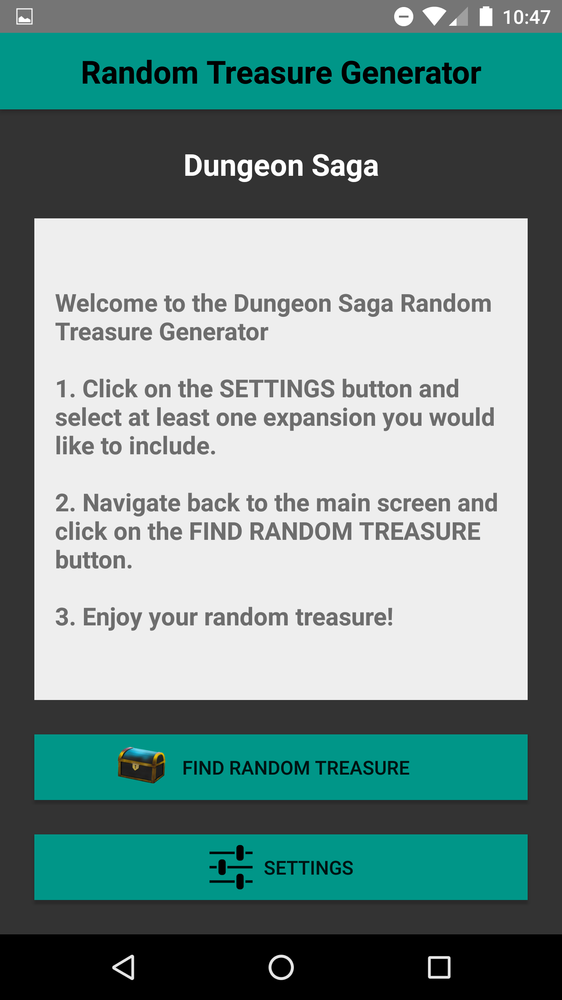
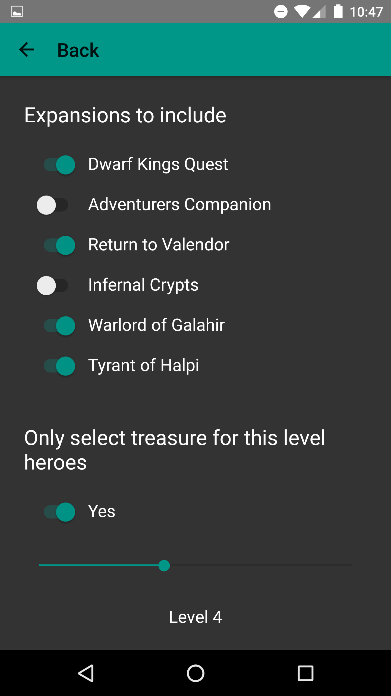
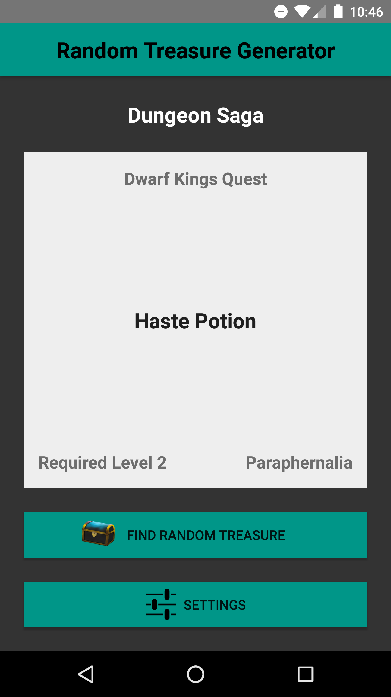
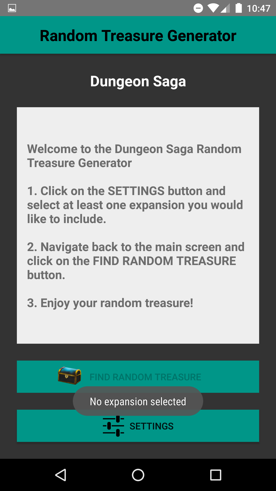

# Dungeon Saga Treasure Chest - Random Treasure Generator

This project can be built into a Random Treasure Generator Android application for Mantic's board game [Dungeon Saga](http://www.manticgames.com/mantic-shop/dungeon-saga/product/dungeon-saga-the-dwarf-kings-quest.html).

When a Dungeon Saga board game player encounters a chest and is prompted to pick a random item, the player can use this application to generate a random treasure.  Player can pick from the list of expansions that they own and can also filter items by level requirements.  This introduces real randomness to the game, helps with poorly shuffled deck, and allows to remove items above player's level.

This application is based on Thomas Sidener's (UIS) iPhone application with the same features.

## SQLite

SQLite database is used to store the list of items, their level, and the expansions they belong to.  Adding items can be done by inserting new records into the database file.  At this point in time adding expansions would require a minor code change.

## Screenshots

Welcome screen with instructions

Settings

Generated item

Warning message when no expansions are selected

